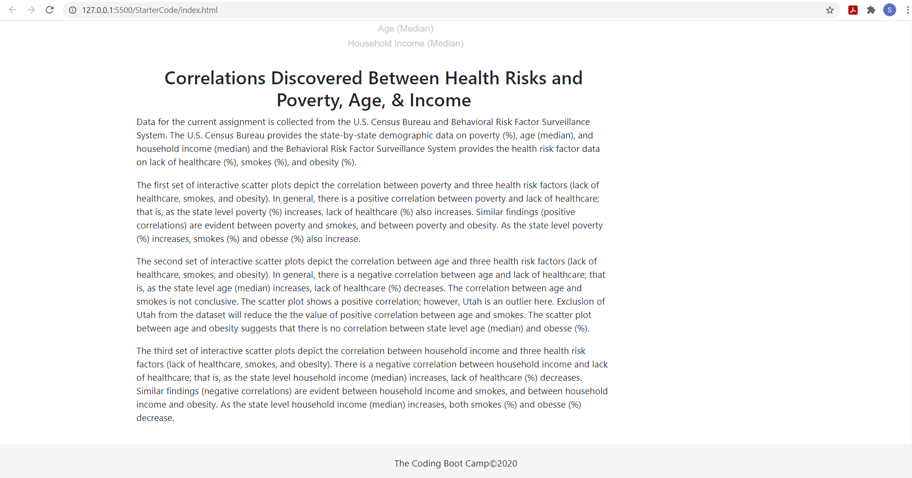

# **D3-Challenge - Data Journalism and D3**

## Background

Welcome to the newsroom! You've just accepted a data visualization position for a major metro paper. You're tasked with analyzing the current trends shaping people's lives, as well as creating charts, graphs, and interactive elements to help readers understand your findings.

The editor wants to run a series of feature stories about the health risks facing particular demographics. She's counting on you to sniff out the first story idea by sifting through information from the U.S. Census Bureau and the Behavioral Risk Factor Surveillance System.

The data set included with the assignment is based on 2014 ACS 1-year estimates from the [US Census Bureau](https://data.census.gov/cedsci/), but you are free to investigate a different data set. The current data set includes data on rates of income, obesity, poverty, etc. by state. MOE stands for "margin of error."

## Your Task

### Core Assignment: D3 Dabbler (Required Assignment)

You need to create a scatter plot between two of the data variables such as `Healthcare vs. Poverty` or `Smokers vs. Age`.

Using the D3 techniques we taught you in class, create a scatter plot that represents each state with circle elements. You'll code this graphic in the `app.js` file of your homework directory—make sure you pull in the data from `data.csv` by using the `d3.csv` function. Your scatter plot should ultimately appear like the image at the top of this section.

* Include state abbreviations in the circles.

* Create and situate your axes and labels to the left and bottom of the chart.

* Note: You'll need to use `python -m http.server` to run the visualization. This will host the page at `localhost:8000` in your web browser.

- - -

### Bonus: Impress the Boss (Optional Assignment)

Why make a static graphic when D3 lets you interact with your data?

#### 1. More Data, More Dynamics

You're going to include more demographics and more risk factors. Place additional labels in your scatter plot and give them click events so that your users can decide which data to display. Animate the transitions for your circles' locations as well as the range of your axes. Do this for two risk factors for each axis. Or, for an extreme challenge, create three for each axis.

* Hint: Try binding all of the CSV data to your circles. This will let you easily determine their x or y values when you click the labels.

#### 2. Incorporate d3-tip

While the ticks on the axes allow us to infer approximate values for each circle, it's impossible to determine the true value without adding another layer of data. Enter tooltips: developers can implement these in their D3 graphics to reveal a specific element's data when the user hovers their cursor over the element. Add tooltips to your circles and display each tooltip with the data that the user has selected. Use the `d3-tip.js` plugin developed by [Justin Palmer](https://github.com/Caged)—we've already included this plugin in your assignment directory.

* Check out [David Gotz's example](https://bl.ocks.org/davegotz/bd54b56723c154d25eedde6504d30ad7) to see how you should implement tooltips with d3-tip.

## Completed Tasks
Link: http://127.0.0.1:5500/StarterCode/index.html

* A set of interactive scatter plots are generated to display the correlations between state-by-state demographic data (poverty, age, and household income) and health risk factors (lack of healthcare, smokes, and obesity). Users can check the correlations between poverty vs. lack of healthcare or smokes or obesse. Similarly users can check the correlations between age vs. three health risk factors and the correlations between household income vs. three health risk factors.  

* Animation is added for the transitions of circles' locations as well as for the range of axes. Tooltips are added to the circles to display the data for corresponding event, i.e., name of the state, value of the chosen x-axis, and value of the chosen y-axis. 

* Analyses of the correlations between state-by-state demographic data and health risk factors are also appended with the dynamic scatter plots. Screen shots of the completed tasks are presented below. 

#### Screen Shot: Poverty vs. Health Risk Factors (lack of healthcare, smokes, & obesse) 

#### Screen Shot: Age vs. Health Risk Factors (lack of healthcare, smokes, & obesse) 

#### Screen Shot: Household Income vs. Health Risk Factors (lack of healthcare, smokes, & obesse) 

#### Screen Shot: Correlation Analyses of Demographic Data vs. Health Risk Factors 

#### Applied Technologies:
* HTML & CSS
* Javascript
* D3 Visualization
* python -m http.server

